## Quizzer
As the name says, This android app is about Quize. There is one client side and server side of this Android App.   
Client side is the main app, and other one is the server side app from where admin can add questions for the main app.   
Both Quizzer and Quizzer Admin apk are provided above.

## Quizzer(Client side)
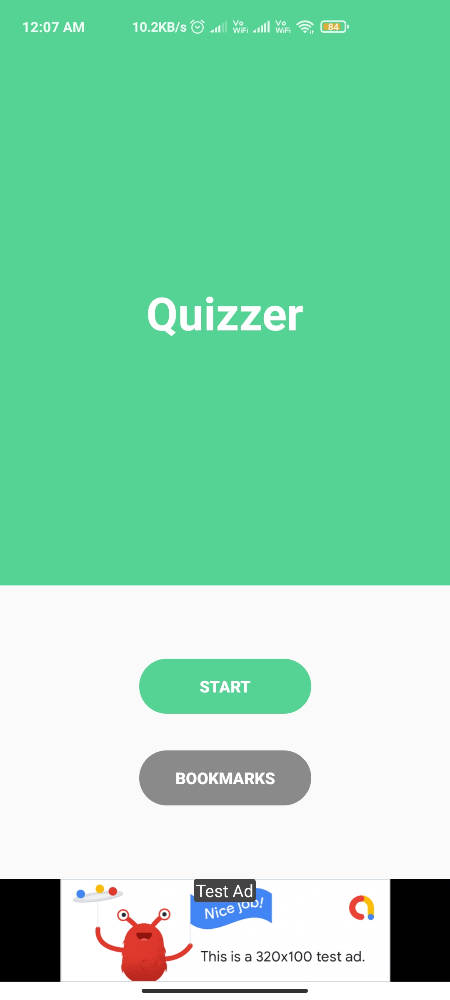 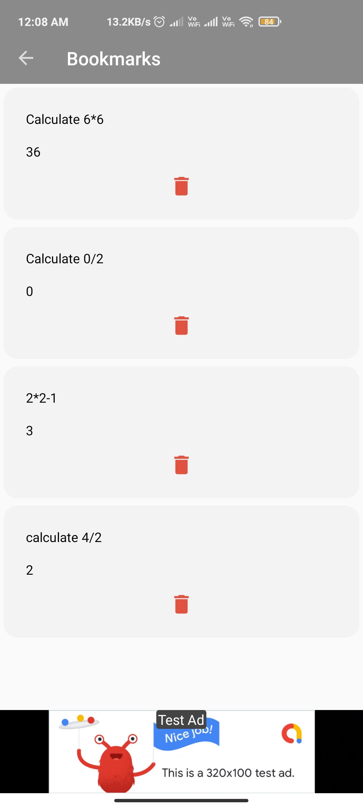  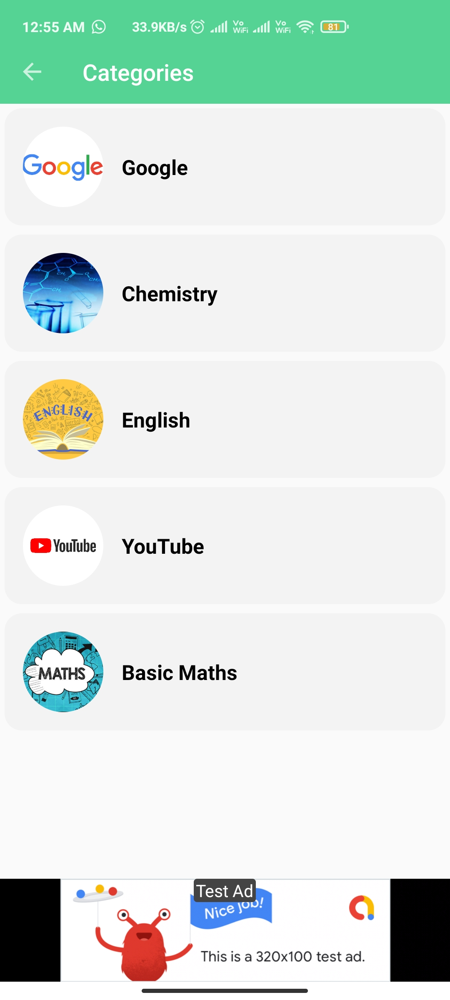 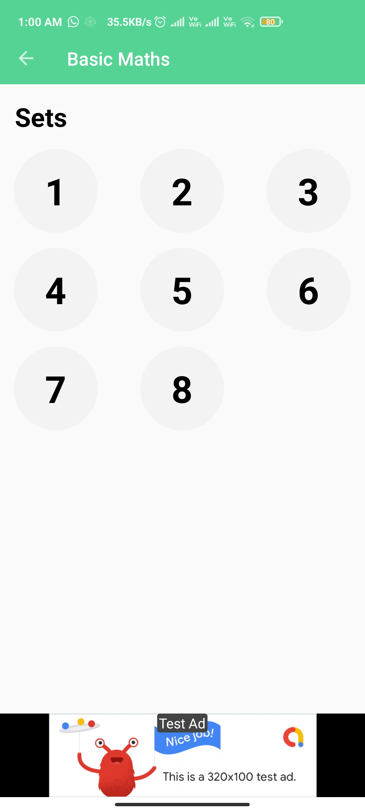 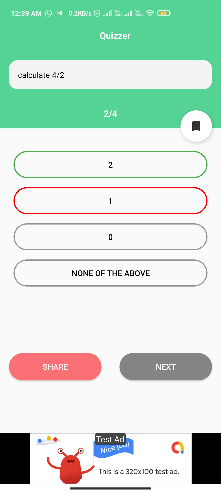 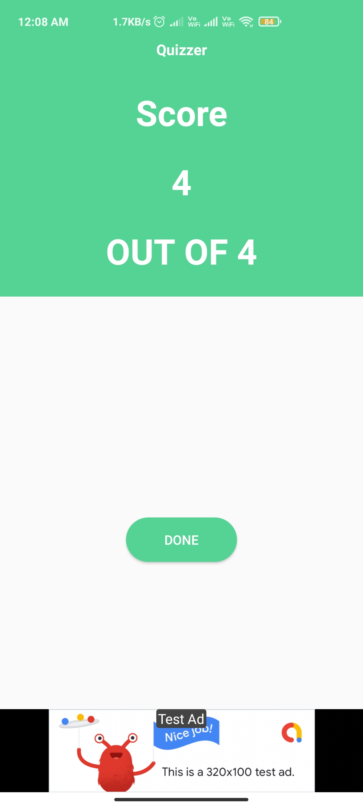    
It has bookmark feature, share with friends, indicates the correct answer if the answer selected is incorrect.   
App consists of ads such as Banner and Interstitial ads.

## Quizzer Admin(Server Side)
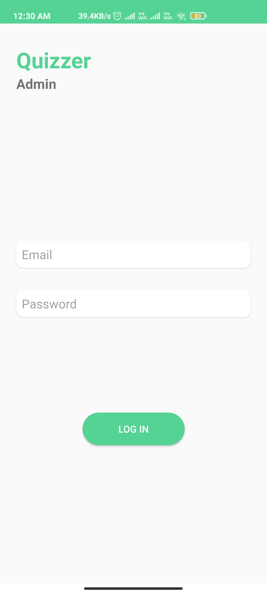 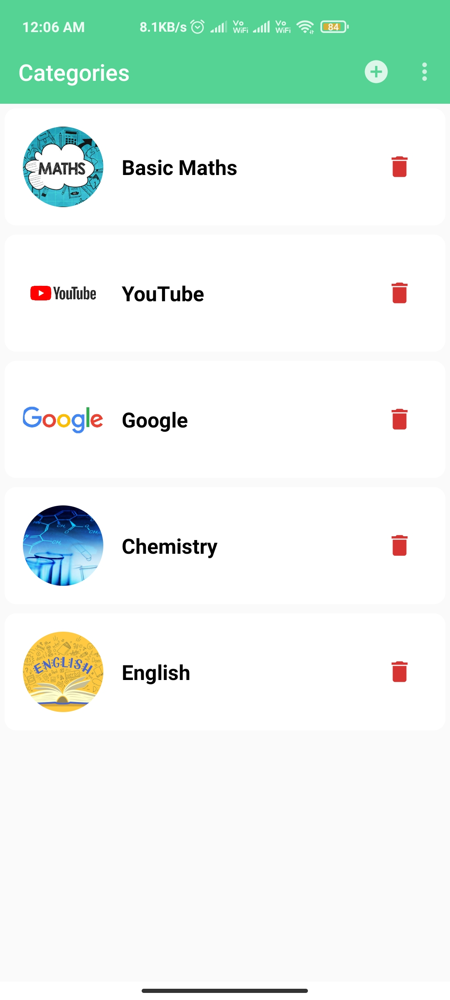  

Admin can add Category by clicking on the "+" icon on the top right, and also delete a category.

    
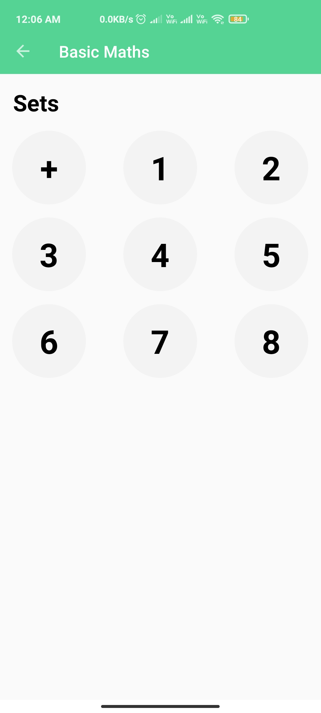 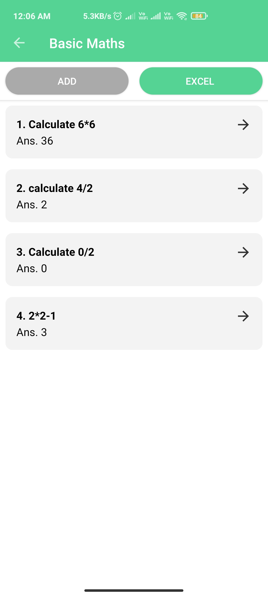 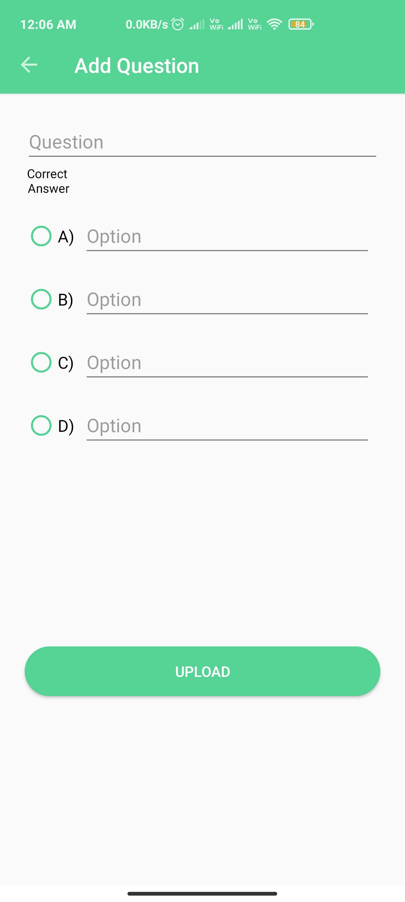   
After clicking on category, Admin can create a set by clicking on "+" and also delete the same by long click on a particular set number.   
After clicking on a set number, admin can add in single question, or select select a excel sheet to fill in question in bulk.
Admin can delete a question by long clicking on it.

## Libaries Used 
1. Firebase
2. Glide
3. Gson
4. Admobs
5. Apache POI
